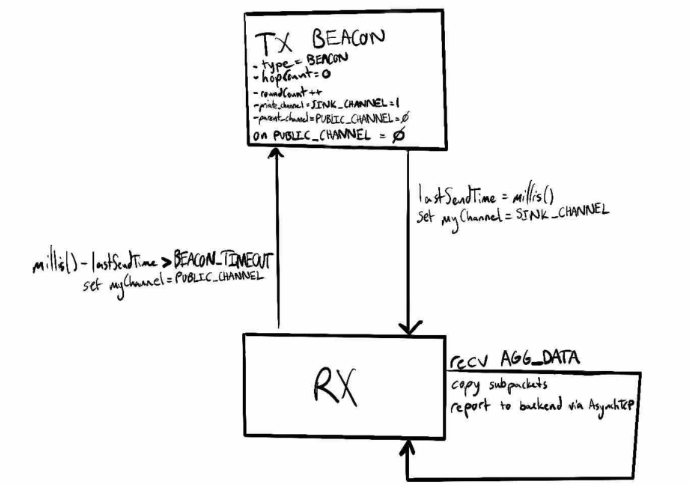
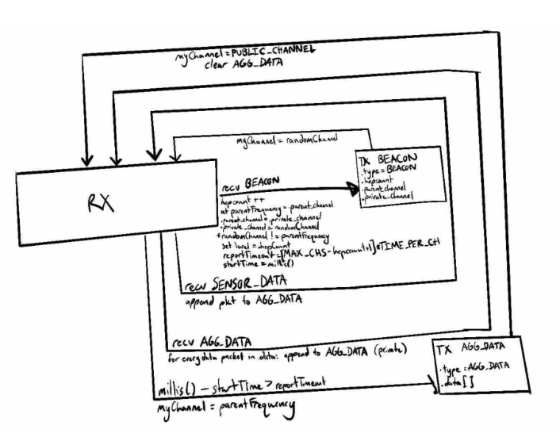
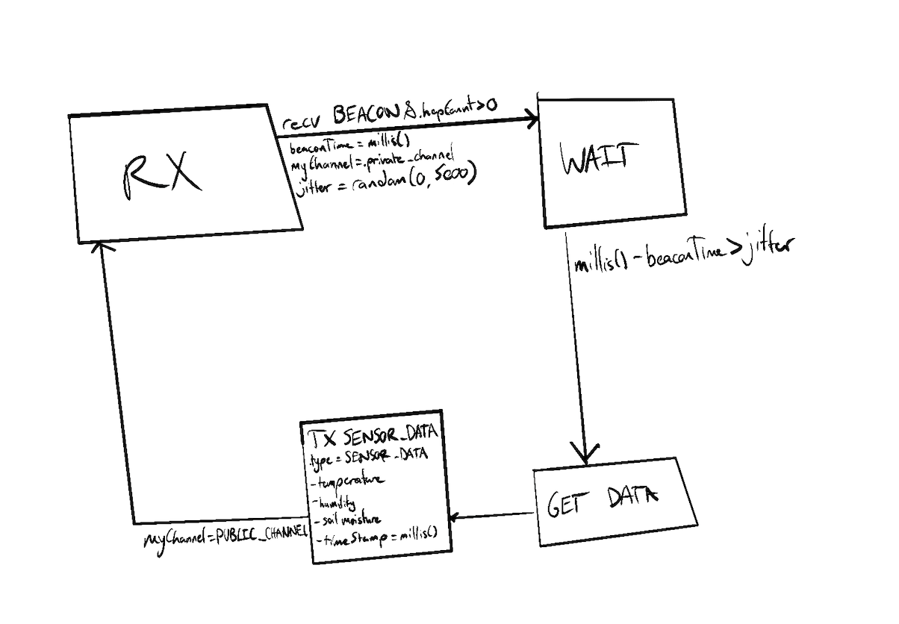

# eureka-v3-lora
A reconfiguration of the Eureka hierarchical protocol using LoRa for increased range.
***
### Documentation included for each .ino file
```cpp
/*
Author: 
Date: 
Board in Arduino IDE: 

Purpose: 

Hardware:
    - Board:
    - Sensors Used:

*/ 
```
***
### Version Synopsis: v1
V1 is currently under devlopment. Its purpose is to transition the existing UCSC EUREKA project's hierarchical sensor network over to LoRa with RadioLib, allowing more power-effcient and longer-range radio transmissions for an off-the-grid fire data collection network. The point is to complete simple data aggregation in a single-chain network, for future versions to expand upon. Started August 16, 2026.
Reference below, the architecture of V1 using LoRa via the RadioLib Library.

Sink State Machine:



Cluster Head State Machine:



Sensor Node State Machine:


***
